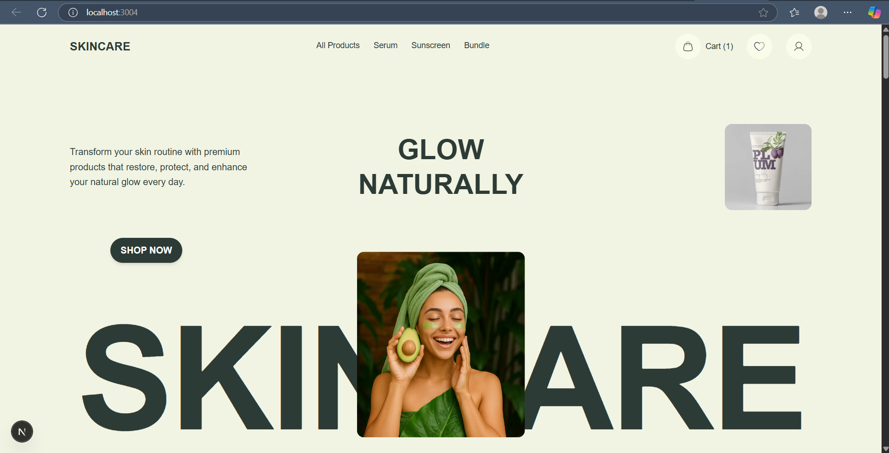
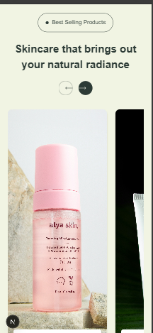

## Skincare Landing Page – Assignment Submission

This repository contains a responsive and animated landing page built as part of a frontend development assignment. The project replicates a skincare brand's homepage based on the provided Figma design, focusing on elegant aesthetics, smooth transitions, and mobile-first responsiveness.

The landing page has been developed using **Next.js**, **React**, **Tailwind CSS**, and **GSAP**, ensuring both performance and modern UI/UX standards.

---

## 🎯 Project Objective

- To create a pixel-perfect implementation of the Figma design  
- Ensure seamless responsiveness across mobile, tablet, and desktop  
- Integrate interactive UI elements with animations for enhanced user experience  
- Maintain clean, scalable, and modular code  

---

## 🔗 Live Deployment

👉 [Click here to view the deployed website](https://sixnine-assignment-pi.vercel.app/)  


## 🛠️ Tech Stack Used

- **Next.js** – React-based framework with built-in routing and optimization  
- **React.js** – For building dynamic UI components  
- **Tailwind CSS** – Utility-first CSS framework for styling and responsiveness  
- **GSAP** – High-performance animations for modern web interfaces  

---

## ✨ Key Features

- 🌟 Smooth entry animation for the hero section (on page load)  
- 🌟 Scroll-based word-by-word text reveal in introductory paragraph  
- 🌟 Responsive layout across breakpoints (Mobile / Tablet / Desktop)  
- 🌟 Interactive “Best Selling Products” section with animated buttons  
- 🌟 Expandable FAQ section with smooth toggle transitions  
- 🌟 Clean code structure with reusable components  

---

## 📁 Folder Structure
<pre> ``` tiyaverma-sixnine/ ├── components/ # Reusable UI sections (Hero, BannerImage, BestSellingProducts, WhyUs, navbar) ├── pages/ # Next.js routing files (index.js, _app.js, _document.js) ├── public/ # All static assets and images ├── styles/ # Tailwind CSS and global styles (globals.css) ├── .gitignore # Files/folders to ignore during git push ├── package.json # Project metadata and dependencies ├── postcss.config.js # PostCSS setup for Tailwind ├── tailwind.config.js # Tailwind customization config └── README.md # Project documentation ``` </pre>

## Some Screens

| Desktop View | Mobile View |
|--------------|-------------|
|  |  |
|  |  |


